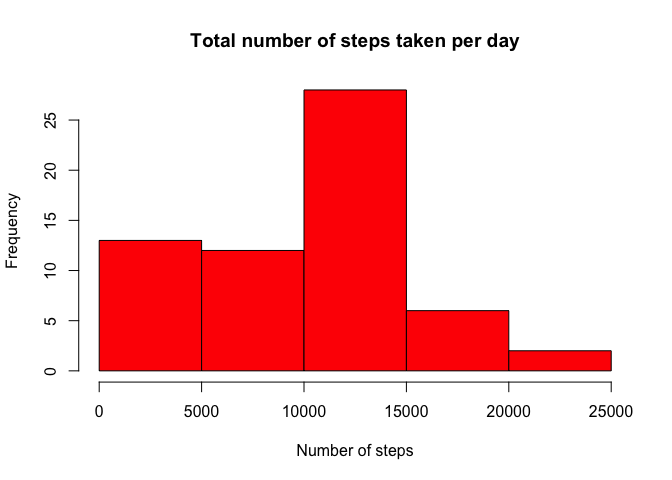
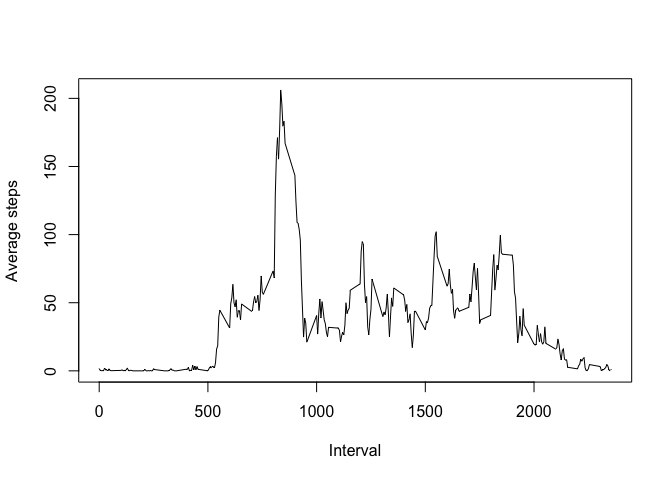
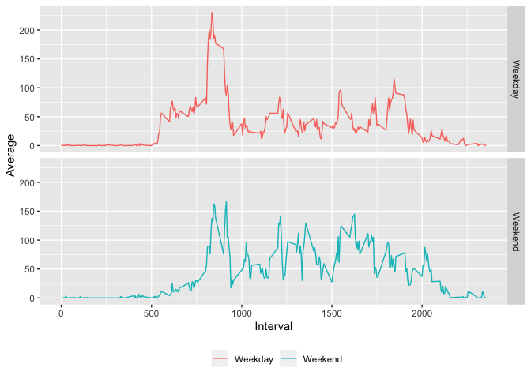

## Introduction
In this document I will answer the questions asked in the first peer-graded assignment of the Coursera course 'Reproducible Research' that is provided by Johns Hopkins University.

## Loading and preprocessing the data
As a first step, we loaded and preprocessed the 'activity.csv'-dataset. The only preprocessing step we made after the data was read in was to convert the date-values in the data.frame from factors to dates.


```r
## Loading and preprocessing the data
# Loading the data
if (!file.exists("data")) {
        dir.create("data")
}

if (!file.exists("./data/activity_data.zip")) {
        fileURL <- "https://d396qusza40orc.cloudfront.net/repdata%2Fdata%2Factivity.zip"
        download.file(fileURL, dest="./data/activity_data.zip", mode = "wb")
}

unzip(zipfile="./data/activity_data.zip")
dta <- read.csv("activity.csv",
                header = TRUE,
                sep = ",",
                na.strings = c("NA"))

# Preprocessing the data
dta$date <- as.Date(dta$date, format = "%Y-%m-%d") # converting from factors to actual dates
```

## What is mean total number of steps taken per day?
This question was answered by following three steps. First, we calculated the total number of steps taken per day, using the 'aggregate'-function. Then we constructed a histogram of the total number of steps taken each day. Lastly we calculated the mean and median of the total number of steps taken per day. We ignored missing values in the dataset by setting na.rm = TRUE in the 'aggregate'-function. Contrary to the na.action = na.omit setting in this funnction, which removes the complete observation in its calculation, the na.rm = TRUE setting simply removes NA-values when calculating the desired statistic.


```r
## Mean total number of steps taken per day
# Total number of steps taken per day
sum.stp <- aggregate(dta$steps, by = list(date = dta$date), sum, na.rm = TRUE)

# Histogram of Total number of steps per day
hist(sum.stp$x, 
     main = "Total number of steps taken per day",
     xlab = "Number of steps",
     col = "red")
```

<!-- -->

The mean and median of the total number of steps taken per day is given below: 


```r
# Mean and median
mean(sum.stp$x, na.rm = TRUE)
```

```
## [1] 9354.23
```

```r
median(sum.stp$x, na.rm = TRUE)
```

```
## [1] 10395
```

```r
remove(sum.stp) # cleaning up the workspace
```

## What is the average daily activity pattern?
To answer this question, we constructed a time series plot of the 5-minute interval (x-axis) and the average number of steps taken averaged across all days (y-axis). We then determined the 5-minute interval that, on average across all the days in the dataset, contains the maximum number of steps.


```r
## Average daily activity pattern?
# Time series plot
ave.stp <- aggregate(dta$steps, by = list(dta$interval), mean, na.rm = TRUE)
colnames(ave.stp) <- c("int", "ave.stp")
plot(ave.stp$int, ave.stp$ave.stp,
     xlab = "Interval",
     ylab = "Average steps",
     type = "l")
```

<!-- -->

The 5-minute interval that, on average across all the days in the dataset, contains the maximum number of steps is given by the following code. This is the 8:35 time interval.


```r
# Maximum number of steps
ave.stp[ave.stp$ave.stp == max(ave.stp$ave.stp), ][1]
```

```
##     int
## 104 835
```

## Imputing missing values
Because there are numerous missing values in the steps column of the activity dataset, we needed to devise a strategy to impute these missing values. The message was to keep it simple, so we decided to opt for imputing missing values for a certain interval on a certain date by calculating the average of the number of steps for all dates that had steps data available for that interval. The code below takes care of this, and it results in a new dataset (dta.new) that contains the imputed values:


```r
## Imputing missing values
#Calculate and report the total number of missing values in the dataset (i.e. the total number of rows with NAs)
#We impute values based on average steps by interval, using the ave.stp data frame
dta <- merge(dta, ave.stp, by.x = "interval", by.y = "int"); remove(ave.stp); # merging the dta with the ave.stp dataframe
dta$stp.new <- ifelse(is.na(dta$steps), dta$ave.stp, dta$steps) # replacing NA-values in steps column (we create a new column)
dta <- dta[order(dta$date), ] # order the resulting data frame by date

#Create a new dataset that is equal to the original dataset but with the missing data filled in.
dta.new <- dta[c(5,3,1)]
colnames(dta.new) <- c("steps", "date", "interval")
dta <- dta[c(2, 3, 1)] # restoring the original data frame
```

Similarly to the plot and statistics asked for under the "What is the average daily activity pattern?"-header, we use the dataset with the imputed data to create a histogram of the total number of steps taken each day.


```r
## Mean total number of steps taken per day
# Total number of steps taken per day
sum.stp <- aggregate(dta.new$steps, by = list(date = dta.new$date), sum, na.rm = TRUE)

# Histogram of Total number of steps per day
hist(sum.stp$x, 
     main = "Total number of steps taken per day",
     xlab = "Number of steps",
     col = "red")
```

<!-- -->

We also calculated the mean and median total number of steps taken per day using the imputed data. The mean and median are as follows:


```r
# Mean and median
mean(sum.stp$x, na.rm = TRUE)
```

```
## [1] 10766.19
```

```r
median(sum.stp$x, na.rm = TRUE)
```

```
## [1] 10766.19
```

```r
remove(sum.stp) # cleaning up the workspace
```

When we compare the mean and median of 10766.19 with the earlier reported mean of 9354.23 and median of 10395, we can conclude that these values indeed differ from the values obtained in the first part of the assignment. In addition, the impact of imputing missing data on the estimates of the total number of daily steps is that the new mean and median are somewhat higher compared to the original mean and median.

## Are there differences in activity patterns between weekdays and weekends?
For this part we used the weekdays()-function and the ggplot2-package to shed light on the issue. First, we wrote the code below that creates a new factor variable 'wds' that indicates whether a given data is a weekday or a weekend day.


```r
## Differences in activity patterns between weekdays and weekends?
# For this part the weekdays() function may be of some help here. Use the dataset with the filled-in missing values for this part.

# Create a new factor variable in the dataset with two levels – “weekday” and “weekend” indicating whether a given date is a weekday or weekend day.
dta.new$dys <- weekdays(dta.new$date)
dta.new$wds <- ifelse(dta.new$dys %in% c("Saturday", "Sunday"), "Weekend", "Weekday")
```

Secondly, we created a panel plot that shows a time series plot of the 5-minute interval (x-axis) and the average number of steps taken, averaged across all weekday days or weekend days (y-axis):


```r
# Make a panel plot containing a time series plot (i.e. type = "l") of the 5-minute interval (x-axis) and the average number of steps taken, averaged across all weekday days or weekend days (y-axis). 
# See the README file in the GitHub repository to see an example of what this plot should look like using simulated data.

ave.stp <- aggregate(dta.new$steps, by = list(dta.new$interval, dta.new$wds), mean, na.rm = TRUE)
colnames(ave.stp) <- c("Interval", "typ.day", "Average")

library(ggplot2)
ggplot(ave.stp, aes(x = Interval, y = Average, color = typ.day)) +
       geom_line() +
       facet_grid(rows = vars(typ.day)) +
       theme(legend.position = "bottom", legend.title = element_blank())
```

<!-- -->
